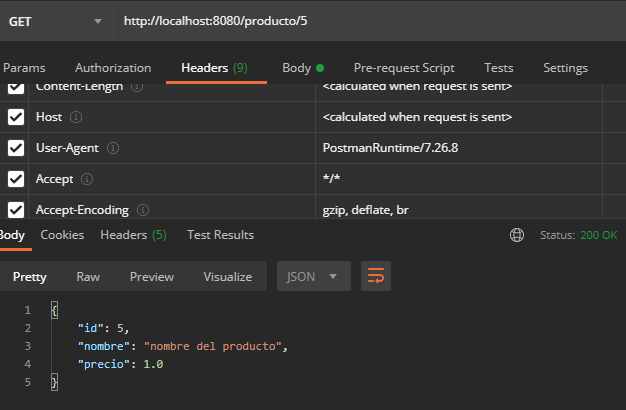
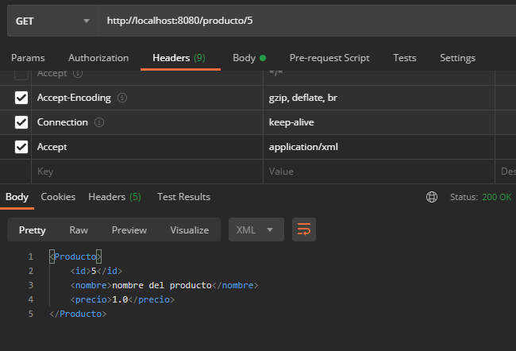

## Ejemplo 3: Negociación de contenido

### OBJETIVO
- Aprender las formas que Spring MVC ofrece para regresar al usuario una respuesta usando en formatos o tipos de contenido.
- Indicar si una respuesta debe recibirse en formato JSON o en formato XML.

#### REQUISITOS
- Tener instalado el IDE IntelliJ Idea Community Edition.
- Tener instalada la última versión del JDK 11 o 17.
- Tener instalada la herramienta Postman.

#### Desarrollo
1. Crea un proyecto Maven usando Spring Initializr desde el IDE IntelliJ Idea.

2. En la ventana que se abre selecciona las siguientes opciones:
- Grupo, artefacto y nombre del proyecto.
- Tipo de proyecto: **Maven Project**.
- Lenguaje: **Java**.
- Forma de empaquetar la aplicación: **jar**.
- Versión de Java: **11** o **17**.

3. En la siguiente ventana elige **Spring Web** como dependencia del proyecto.

4. Dale un nombre y una ubicación al proyecto y presiona el botón Finish.

5. En el proyecto que se acaba de crear debes tener el siguiente paquete `org.bedu.java.backend.sesion4.ejemplo3`. Dentro crea dos subpaquetes: `model` y `controllers`.

6. Dentro del paquete `model` crea una nueva clase llamada "`Producto`" con los siguientes atributos:

```java
    private long id;
    private String nombre;
    private float precio;    
```

Agrega también los *getter*s y *setter*s de cada atributo.

7. En el paquete `controllers` agrega una clase llamada `ProductoController` y decórala con la anotación `@RestController`, de la siguiente forma:

```java
@RestController
@RequestMapping("/producto")
public class ProductoController {

}
```

8. Agrega un nuevo manejador de peticiones **GET**, de la siguiente forma:

```java
    @GetMapping(value = "/{productoId}")
    public ResponseEntity<Producto> getProducto(@PathVariable long productoId){
        Producto producto = new Producto();
        producto.setNombre("nombre del producto");
        producto.setId(productoId);
        producto.setPrecio(1.00f);

        return ResponseEntity.ok(producto);
    }
```

9. En el archivo `pom.xml` agrega la siguiente dependencia:
```xml
  <dependency>
    <groupId>org.springframework.boot</groupId>
    <artifactId>spring-boot-starter-web</artifactId>
  </dependency>
```

10. Ejecuta la aplicación y, desde Postman, envía una petición **GET** a la siguiente URL: `http://localhost:8080/producto/5`. Debes obtener un resultado como el siguiente:



11. En Postman agrega una cabecera llamada `Accept` que tenga como valor `application/xml` y envía nuevamente la petición, ahora debes obtener un resultado en formato XML:



