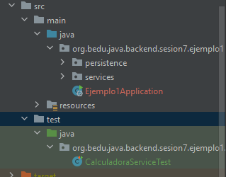
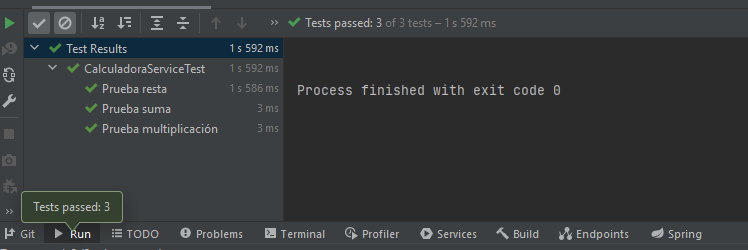

## Ejemplo 1: Pruebas unitarias con JUnit 5 y Mockito

### OBJETIVO

- Crear una prueba que valide el correcto funcionamiento de una clase o componente.
- Simular el funcionamiento de una clase que aún no existe, usando un mock creado con Mockito.


#### REQUISITOS
- Tener instalado el IDE IntelliJ Idea Community Edition con el plugin de Lombok activado.
- Tener instalada la última versión del JDK 11 o 17.


#### DESARROLLO

1. Crea un proyecto Maven usando Spring Initializr desde el IDE IntelliJ Idea.

2. En la ventana que se abre selecciona las siguientes opciones:
- Grupo, artefacto y nombre del proyecto.
- Tipo de proyecto: **Maven Project**.
- Lenguaje: **Java**.
- Forma de empaquetar la aplicación: **jar**.
- Versión de Java: **11** o **17**.

3. En la siguiente ventana elige **Spring Web** y **Lombok** como dependencias del proyecto. En automático se agregarán también las dependencias para realizar pruebas unitarias.

4. Dale un nombre y una ubicación al proyecto y presiona el botón *Finish*.

5. En el proyecto que se acaba de crear debes tener el siguiente paquete `org.bedu.java.backend.sesion7.ejemplo1`. Dentro crea los subpaquetes: `persistence`, `services`.

6. Dentro del paquete `persistence` crea una interface llamada `CalculadoraDao` de la siguiente forma:
```java
    @Component
    public interface CalculadoraDao {
        int findValorConstante();
    }
```
Esta interface nos ayudará a simular que se lee un valor constante de una base de datos. Sin embargo, no habrá ninguna clase que implemente esta interface (y por eso deberemos crear un mock para simular su comportamiento).


7. En el paquete `services` crea una clase llamada `CalculadoraService` y decórala con la anotación `@Service` de Spring.
```java@Service
public class CalculadoraService {
}
```

8. Coloca tres métodos dentro de esta clase, uno que regresará la suma de dos valores, otro su resta y un tercero para su multiplicación:
```java
    public int suma(int a, int b) {
        return a + b;
    }
    public int resta(int a, int b) {
        return a - b;
    }
    public int multiplica(int a, int b) {
        return a * b;
    }
```

9. Modificaremos el valor de cada una de las operaciones sumándoles un valor constante que será regresado por el método `findValorConstante` de la interfaz `CalculadoraDao`
```java
    public int suma(int a, int b) {
        return a + b + calculadoraDao.findValorConstante();
    }
    public int resta(int a, int b) {
        return a - b + calculadoraDao.findValorConstante();
    }
    public int multiplica(int a, int b) {
        return a * b + calculadoraDao.findValorConstante();
    }
```

10. Agrega una referencia a esta interface y usa la anotación `@RequiredArgsConstructor` de Lombok para inyectarla:
```java
@Service
@RequiredArgsConstructor
public class CalculadoraService {
    private final CalculadoraDao calculadoraDao;
    
}
```

11. En el directorio de pruebas de Maven agrega una nueva clase llamada `CalculadoraServiceTest`.




12. Decora la nueva clase con la anotación `@ExtendWith(MockitoExtension.class)`, la cual indica que usarás las funcionalidades de Mockito para la prueba. Como no hay una implementación de la interface `CalculadoraDao` (aunque `CalculadoraService` la necesita), será necesario crear un objeto mock para poder completar la prueba unitaria. 

13. Agrega una instancia de tipo `CalculadoraDao` y decórala con la anotación `@Mock`:

```java
    @Mock
    CalculadoraDao calculadoraDao;
```
14. Agrega una instancia de tipo `CalculadoraService`, que es la clase que probaremos, y decórala con la anotación `@InjectMocks` para indicar que los mocks creados se deben inyectar en esta clase.

```java
    @InjectMocks
    private CalculadoraService calculadora;
```

15. Agrega un método decorado con `@BeforeEach`, el cual se ejecuta antes de cada método de prueba. Dentro de este configura la respuesta que regresara el mock de tipo `CalculadoraDao` cuando se haga una llamada al método `findValorConstante`. En este caso la respuesta será el valor **3**; eso quiere decir que a todas las operaciones realizads se les sumará el valor 3.

```java
    @BeforeEach
    void setUp(){
        given(calculadoraDao.findValorConstante()).willReturn(3);
    }
```

16. Crea un método llamado `sumaTest` para verificar la suma. Usa el método `assertEquals` de JUnit para asegurar que los valores regresados son correctos. Los métodos de prueba deben decorarse siempre con la anotación `@Test`:
```java
    @Test
    @DisplayName("Prueba suma")
    void sumaTest() {
        int esperado = 8;
        assertEquals(esperado, calculadora.suma(3, 2));
    }
```

17. Haz lo mismo para probar la resta y la multiplicación:
```java
    @Test
    @DisplayName("Prueba resta")
    void restaTest() {
        int esperado = 4;
        assertEquals(esperado, calculadora.resta(3, 2));
    }
    @Test
    @DisplayName("Prueba multiplicación")
    void multiplicaTest() {
        int esperado = 9;
        assertEquals(esperado, calculadora.multiplica(3, 2));
    }
```

18. Ejecuta la prueba haciendo clic derecho sobre el editor de código y seleccionando la opción `Run CalculadoraServiceTest` o haciendo clic sobre las dos flechas verdes que aparecen junto al nombre de la clase:


19. Debes ver el siguiente resultado en la consola de IntelliJ:


